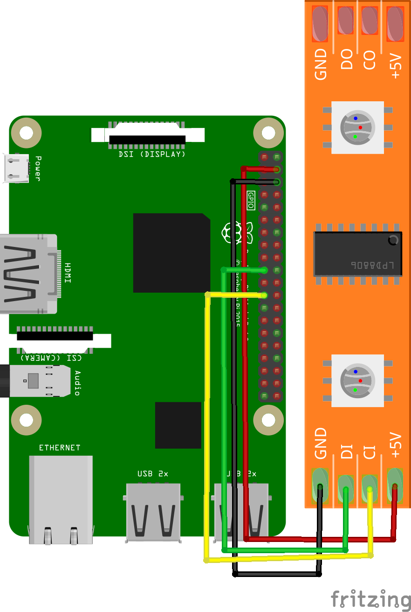

RGB LED strip (APA102) sample for Android Things
================================================

This Android Things sample demonstrates how to interface with a basic 
RGB led strip using the APA102 over SPI protocol.


Pre-requisites
--------------

- Android Things compatible board
- Android Studio 2.2+
- [Rainbow Hat for Android Things](https://shop.pimoroni.com/products/rainbow-hat-for-android-things) or the following individual components:
    - 1 [APA102 compatible RGB Led strip](https://www.adafruit.com/product/2241)
    - jumper wires

Schematics
----------

If you have the Raspberry Pi [Rainbow Hat for Android Things](https://shop.pimoroni.com/products/rainbow-hat-for-android-things), just plug it onto your Raspberry Pi 3.



The 5v and GND from the Edison and Raspberry Pi 3 are sufficient for driving a few LEDs,
connect these pins to the power pins on the APA102 connector.

Build and install
=================

On Android Studio, edit the `MainActivity.java` file and set the correct number
of LEDs in your LED strip (constant `NUM_LEDS`).

Then, click on the "Run" button.

If you prefer to run on the command line, from this repository's root directory, type

```bash
./gradlew apa102:installDebug
adb shell am start com.example.androidthings.driversamples/.MainActivity
```

The LEDs will blink in various patterns.

Troubleshooting
=================

For a strip with more than a few LEDs, use an external power adapter for your
board, or power the LED strip from an external power source.

License
-------

Copyright 2016 The Android Open Source Project, Inc.

Licensed to the Apache Software Foundation (ASF) under one or more contributor
license agreements.  See the NOTICE file distributed with this work for
additional information regarding copyright ownership.  The ASF licenses this
file to you under the Apache License, Version 2.0 (the "License"); you may not
use this file except in compliance with the License.  You may obtain a copy of
the License at

  http://www.apache.org/licenses/LICENSE-2.0

Unless required by applicable law or agreed to in writing, software
distributed under the License is distributed on an "AS IS" BASIS, WITHOUT
WARRANTIES OR CONDITIONS OF ANY KIND, either express or implied.  See the
License for the specific language governing permissions and limitations under
the License.
